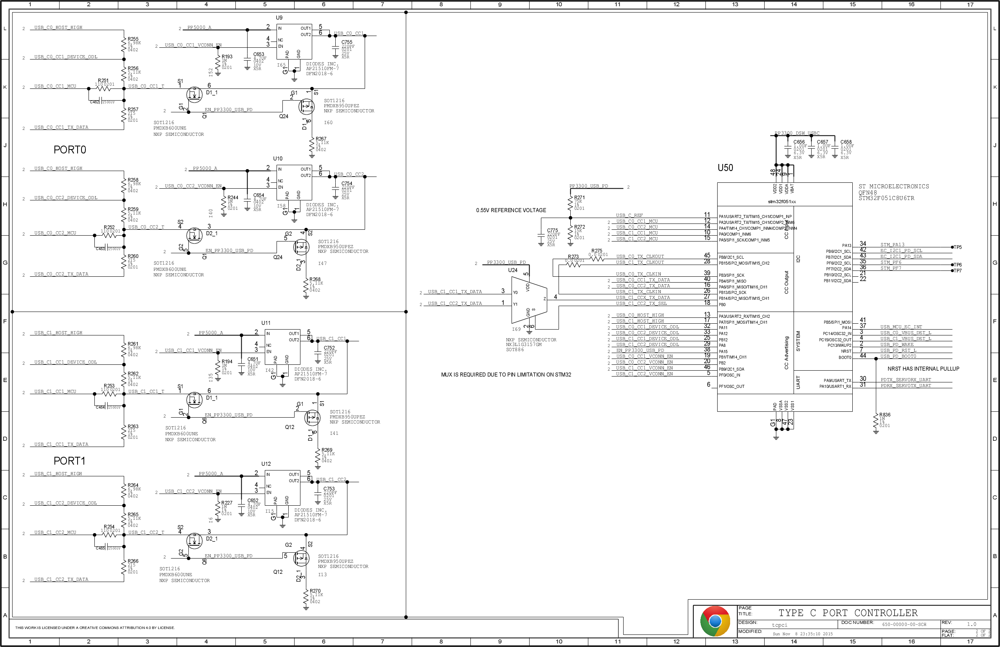
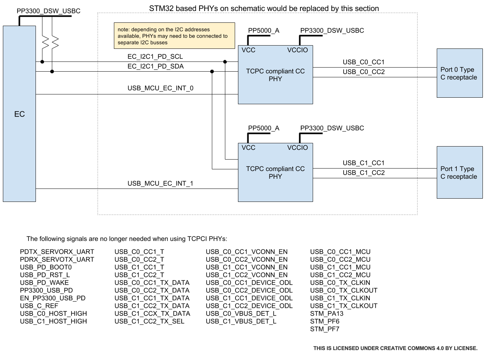

USB-C Dual TCPC Example
=======================

This board configuration implements a USB-C TCPC for two ports.

The design uses a microcontroller running code from the Chromium EC
codebase to implement the TCPC.  The code tries to follow the "USB
Type-C Port Controller Interface Specification" that is released as
part of the
[USB 3.1 Specification](http://www.usb.org/developers/docs/).

Building
--------

### Chromium OS chroot

All the following instructions have been verified in a Chromium OS
chroot.  You can find how to set one up on the
[Chromium development
wiki](http://dev.chromium.org/chromium-os/quick-start-guide).

### Build the TCPM code

`cd src/platform/ec`

`make BOARD=glados_pd`

Schematic
---------

Note that you may need to zoom in the browser to read the image if
reading this through the git source tree browser. A
[pdf of this schematic](glados_pd.pdf) is in the
[`board/glados_pd`](.) directory. It shows three main areas.

The two (identical) sections on the left provide the analog interface
to the CC line.  Each CC line is identical. Resistors are used in
combination to set the resistor applied to CC:

Resistor |`USB_Cx_CCy_DEVICE_ODL`|`USB_Cx_CCy_HOST_HIGH`|Value
---------|-----------------------|----------------------|-----
1.5A Rp  | high impedance        | high 3.3V            | 5.11k+6.98k pullup
3A Rp    | high 3.3V             | high impedance       | 5.11k pullup
Rd       | low 0V                | high impedance       | 5.11k pulldown

When USB-PD transmission is required the `USB_Cx_CCy_MCU` is set low
and the data transmitted on `USB_Cx_CCy_TX_DATA`. The two resistors
form a divider that sets the level to match the BMC
specification. These resistors and the capacitor on the pulldown may
need tuning for a given application to meet the required TX eye mask.

The `EN_PP3300_USB_PD` is a critical enable output from the MCU. It
must be pulled down when power is off (not shown here, it is done as
part of the load switch on the power supply page) and remains low
until the microcontroller is ready for operation. It:

1. Enables the `PP3300_USB_PD` power supply that powers
all the USB-C port related components (eg the low speed mux `U24`
shown here and the high speed mux that is not part of this example
page)
2. Controls the isolation FET (two parts of `Q1`,two parts of `Q6`) to
disconnet the CC lines when power is off or the MCU is
intializing. When power is enabled the enable will put the gate at
3.3V and ensure no higher voltage on CC will reach the MCU.
3. Disables the Dead Battery pulldown once the MCU is ready for
operation. The Dead Battery Rd pulldown is provided by a FET (two
parts of `Q24` and `Q12`) and resistor. When there is no power, the
gate is pulled down to ground. A DFP application of Rp will pull up
the source and provide the required Vgs=-0.7 (Vgsth max should be 1V)
to turn on the FET and connect the Rd pulldown. Once there is power
and the MCU is running it will drive `EN_PP3300_USB_PD` high and
disable the FET.

There is a load switch (`U9`,`U10`,`U11`,`U12`) to provide current
limited **Vconn**.

The main area of the schematic is the STM32F051 microcontroller that
runs the [`glados_pd`](.) code.

There is a quirk in `U24`. For port `C0` the transmit data is provided
by the SPI1 controller as `SPI1_MISO`. The internal I/O multiplex
allows this to be driven on either pin `PB4` or `PA6` and thus support
driving whichever CC line is needed. Port `C1` uses the SPI2
controller which (on this package) can only use pin `PB14`, so an
external mux is used to direct this to the appropriate port.

### Replacement with Two TCPC parts

This schematic page can be replaced by two TCPC parts.

Flashing and Running
--------------------

### Flashing the firmware binary

The microcontroller can be pre-programmed or is programmed in the
factory by pulling `USB_PD_BOOT0` high and resetting the part to
initiate a firmware update over UART. During development the
[Servo board](http://www.chromium.org/chromium-os/servo) can be used
for this.

Once programmed for the first time, the part supports secure update of
the Read/Write copy.

Known Issues
------------

1. This is the first version of the documentation...

Troubleshooting
---------------

