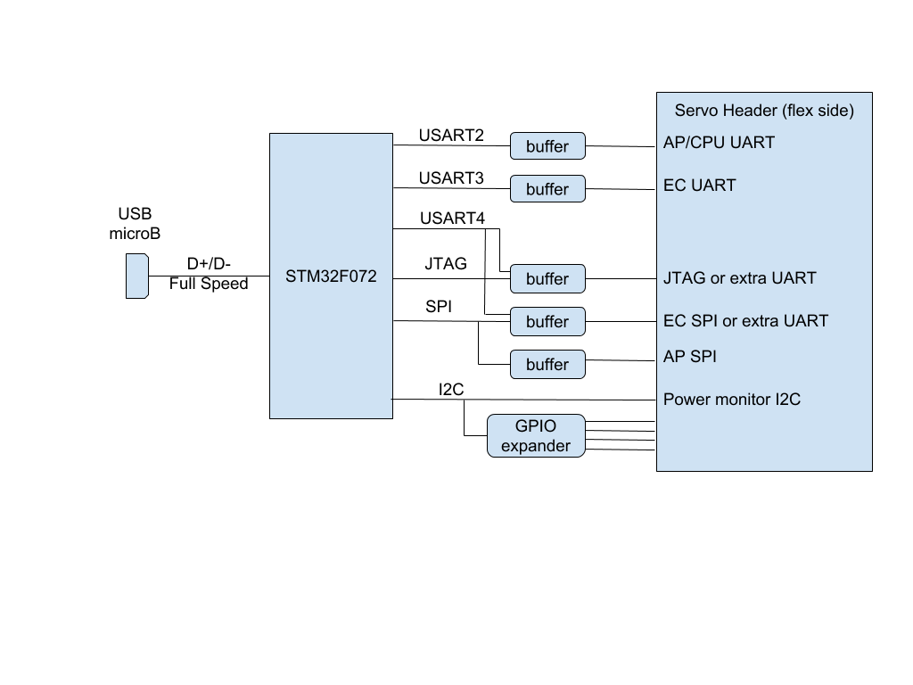

<!--
 Copyright 2018 The Chromium OS Authors. All rights reserved.
 Use of this source code is governed by a BSD-style license that can be
 found in the LICENSE file.
-->

# Case-Closed Debug in Chromebooks and Servo Micro

The Servo debug/test-automation connector has been required on all
chromebooks. It has proved essential to performing the required testing to meet
the six week OS release cycle, for bringing up new systems and qualifying new
components. In newer form-factors it is becoming hard to fit the Servo connector
(and related flex) and in some designs the thermal solution stops working when
the connector is used. The secure Case-Closed Debugging solution provides the
same capabilities and can take advantage of the Debug Mode detection available
on the USB-C connector. This application note gives an overview of Case-Closed
Debug (CCD) but does not address the related security issues.


## Introduction to Case-Closed Debug

Case-Closed Debug provides the same set of features as are available on the Servo connector:

*   Access to console UART connections to AP, EC and on some systems a third MCU
*   Ability to reprogram firmware/BIOS SPI flash used by the AP
*   Ability to reprogram SPI flash used by the EC or use a firmware update mode
    to reprogram the internal flash on the EC (using UART or I2C)
*   GPIOs for holding the EC (and thus entire system) or AP in reset
*   Act as master on a debug I2C that is primarily used for power
    measurements. This bus normally contains INA voltage/current monitors and
    temperature monitors that will not be populated on final MP systems.
*   JTAG/SWD could be provided but has not been implemented on any existing system.

When the Servo connector is used these interfaces are presented on well defined
pins of the board-to-board connector and a flex is used to attach to the
external Servo controller. The height needed for the mated board-to-board
connector is not available in newer slim designs, and the disruption caused by
the flex may interfere with thermal solutions. In a system using Case-Closed
Debug the interfaces are gathered by a part on the board into a single USB
interface that can come out of the system on an existing connector. In
particular, the USB-C connector has two SideBand Use pins (SBU1, SBU2) that can
be used for the debug USB while the main link on the connector continues to be
available. (The SBU pins are also used by some Alternate Modes, so the connector
cannot be used for video out at the same time as debugging.)


## Servo Micro: Using CCD with existing boards

The Servo Micro implements the CCD functions in a way that can connect to
existing boards and thus can also serve as an easy introduction to the CCD
implementation. The debug USB interface is expanded by a STM32F072 into an
existing Servo flex connector that can be plugged into the target board.



The Servo Micro includes the voltage level buffering between the microcontroller
and the device under test (DUT), making use of the DUT supplied reference
voltages. To allow use with all the existing designs a third UART (not on the
original Servo connector, but on some designs) can be connected to either the
JTAG pins or the SPI pins. It is capable of providing the SPI flash supply
voltages.

The schematics for Servo Micro are available [as a
pdf](servo_micro_sch_20180404.pdf).

Servo Micro has a USB micro-B connector and acts as a USB device.

Schematic sheet 2 shows the STM32 powered from the uB connector. The UART3 pins
can also be used as GPIO pins when driving the JTAG interface. As a useful but
non-compliant hack if the ID pin on the uB is low then Q4 will force the STM32
to boot in programming mode. This allows initial programming of the part with
USB DFU using an illegal USB-A plug to USB-A plug cable and a USB-A receptacle
to uB plug adapter. Alternatively the initial programming can be done using a
UART connection on CN2.

Schematic sheet 3 shows the I2C GPIO expander and the buffers for JTAG/SWD. The
buffers adapt to the voltage needed on the DUT that is provided on
`PPDUT_JTAG_VREF`. In the SWD case the TDI becomes the bidirectional SWDIO but the
STM32 continues to use a discrete input and output pin. The DUT signal is
received through U55 and a selection made with U1 to determine if to forward TDO
from the DUT or the TDI/SWDIO. Because of the shared pins on the STM32 the JTAG
interface can alternatively be used to connect UART3 to the DUT for a few
chromebook models.

Schematic sheet 4 shows the buffers for the SPI interfaces. Again the
`PPDUT_SPIn_VREF` sets the voltage level required from the DUT. However, I61 and
I62 (which are expanded on sheets 7 and 8) allow the Servo Micro to supply 3.3V
or 1.8V for cases where the DUT does not provide the reference (care is needed
to select the correct voltage for the given DUT). Only one of the SPI interfaces
can be used at any time, so the buffers are also used to select which connects
to the STM32 SPI pins. Certain chromebook models connect the UART3 in place of
SPI1 which is enabled using U5 to select between the STM32 UART3 (TX,RX) and SPI
(CLK, MISO).

Schematic sheet 5 shows the buffers for the UART interfaces. The
`PPDUT_UARTn_VREF` sets the voltage level required from the DUT.

Schematic sheet 6 shows the board-to-board connector that mates with the servo
connector on the DUT.

Schematic sheets 7 and 8 are the expansion of blocks I61 and I62 on sheet 4. The
load switches are carefully selected to have reverse blocking (protecting
against a DUT providing a voltage or both being enabled).

The code for the STM32 in Servo Micro is open source as the
[`servo_micro`](../../board/servo_micro)
board in the [Chromium EC
codebase](https://chromium.googlesource.com/chromiumos/platform/ec/). Essentially
it is a USB device that provides the standard control endpoint and 7 function
endpoints defined in
[`board.h`](board.h).

<!-- does not work in emacs/markdown preview but should in gitlies -->

``` c
    #define USB_EP_USART4_STREAM	1
    #define USB_EP_UPDATE			2
    #define USB_EP_SPI			3
    #define USB_EP_CONSOLE		4
    #define USB_EP_I2C			5
    #define USB_EP_USART3_STREAM	6
    #define USB_EP_USART2_STREAM	7
```


The USART endpoints use the simple `GOOGLE_SERIAL` vendor class to connect the
STM32 UARTs. The CONSOLE endpoint also uses `GOOGLE_STREAM` to connect to the
console of the code running on the STM32. `GOOGLE_STREAM` provides simple byte
streams on the IN and OUT of the endpoint and host support is included in the
standard Linux `drivers/usb/serial/usb-serial-simple.c`

The SPI endpoint is described in
[`chip/stm32/usb_spi.h`](../../chip/stm32/usb_spi.h) and provides a simple
connection to the SPI port. The host support is provided as a [driver in
flashrom](https://chromium.googlesource.com/chromiumos/third_party/flashrom/+/master/raiden_debug_spi.c).

The I2C endpoint is described in [`include/usb_i2c.h`](../../include/usb_i2c.h)
and provides a simple connection to the I2C bus. The host support is provided in
the [hdctools servo
support](https://chromium.googlesource.com/chromiumos/third_party/hdctools/+/master/servo/stm32i2c.py).

The GPIO endpoint is cryptically described in
[`chip/stm32/usb_gpio.h`](../../chip/stm32/usb_gpio.h) and provides simple access
to set/clear and read the GPIO pins. The host support is provided in the
[hdctools servo
support](https://chromium.googlesource.com/chromiumos/third_party/hdctools/+/master/servo/stm32gpio.py).

The UPDATE endpoint is not part of CCD. It provides a method for updating the
STM32 without needing the special boot modes. This uses the [Chromium EC update
over
USB](../../docs/usb_updater.md)
method. The STM32 runs the code in
[`common/usb_update.c`](../../common/usb_update.c).
The host side code is in
[`extra/usb_updater/usb_updater2.c`](../../extra/usb_updater/usb_updater2.c)
and the
[`extra/usb_updater`](../../extra/usb_updater/)
directory contains additional scripts.


## Using CCD on new designs

New chromebook designs implement the CCD in a similar way to Servo Micro. There
are two changes to the Servo Micro:

*   The USB microB connector is replaced with the USB connection being carried
    on the SBU pins of one of the devices USB-C ports. This will only be
    activated when the USB-C port detects a debug accessory or a debug alternate
    mode is entered. Use of the debug connection precludes use of the Display
    Port alternate mode (which also uses the SBU pins) but allows full USB3 and
    USB2 functions including both host and gadget mode.
*   The system security chip will normally lock out debug access. Using secure
    transactions, user authorization and proof of user physical presence it can
    unlock various degrees of debug access.

The full details are part of the Cr50 firmware specification.
