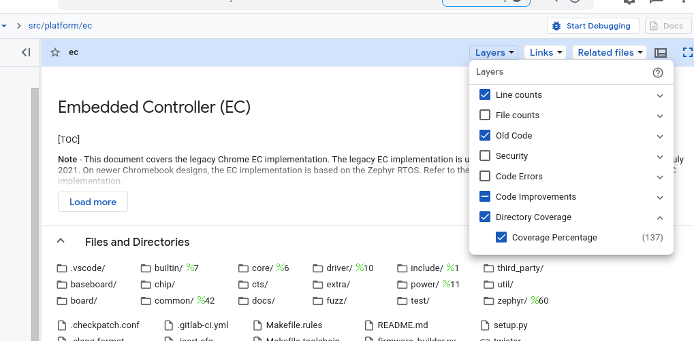
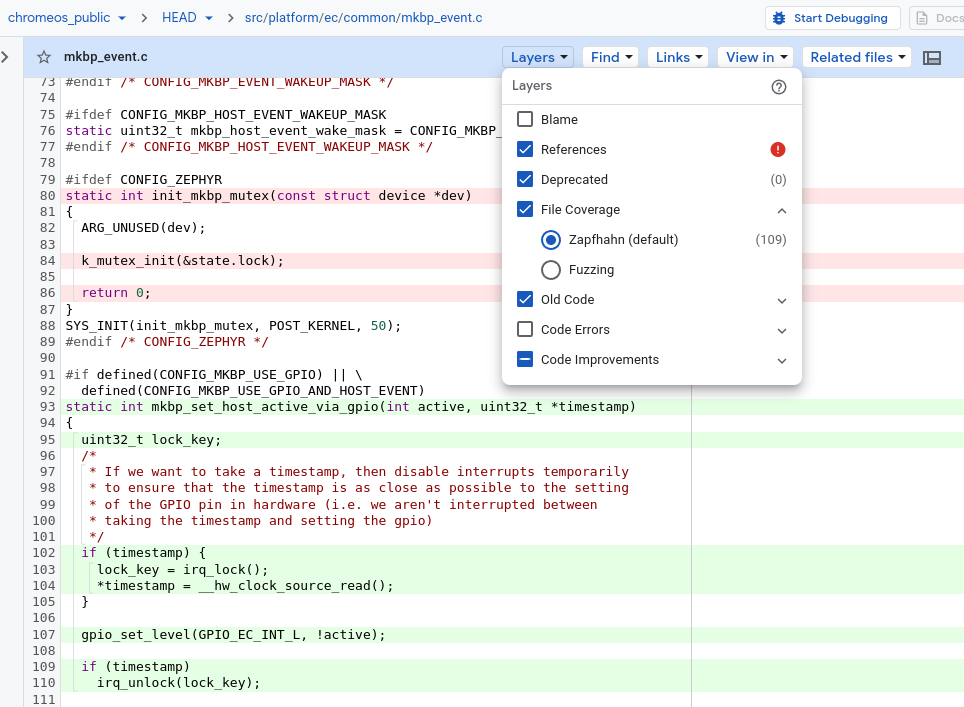
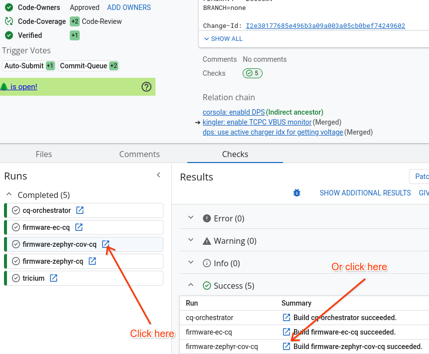
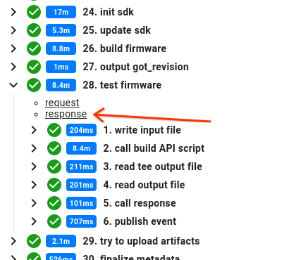
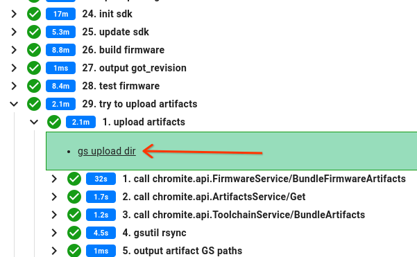
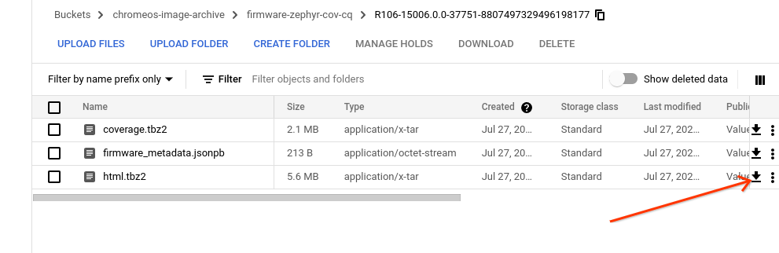
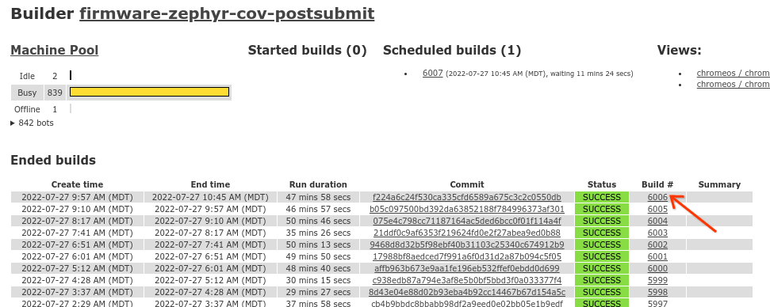

# Code Coverage

Provides an overview of how to use code coverage tools when running the unit
tests in the EC codebase.

[TOC]

## Test Coverage Requirements

All changes to the EC code base require you include tests covering at least 80%
of any new or changed lines of code. Refer to the [ChromeOS EC Firmware Test
Requirements] for details.

## Availability

Code coverage is only available for host-based unit tests, as opposed to manual
tests that run on target hardware.

## Building for code coverage

To build host-based unit tests for code coverage, invoke `make` with the
`coverage` target, as follows:

`make coverage -j`

This target will compile and link the unit tests with `--coverage` flag (which
pulls in the `gcov` libraries), run the tests, and then process the profiling
data into a code coverage report using the `lcov` and `genhtml` tools.

The coverage report top-level page is `build/coverage/coverage_rpt/index.html`.

To get a report for one specific board's coverage run these commands:

```
BOARD=eldrid
make -j$(nproc) build/coverage/initial-${BOARD}.info test-coverage
# Merge board coverage and test coverage
lcov -o build/coverage/${BOARD}_merged.info --rc lcov_branch_coverage=1 \
  -a build/coverage/initial-${BOARD}.info -a build/coverage/lcov.info
# Filter out some unhelpful paths
lcov -o build/coverage/${BOARD}_filtered.info --rc lcov_branch_coverage=1 \
  -r build/coverage/${BOARD}_merged.info ${PWD}'/third_party/**' \
  ${PWD}'/build/**' '/usr/include/**' '/usr/lib/**' '${PWD}/test/**' \
  ${PWD}'/private/fingerprint/*/mcutest/**'
# Restrict to only files used by the board
grep "SF:" "build/coverage/initial-${BOARD}.info" | sort -u | \
      sed -e 's|^SF:||' | xargs lcov --rc lcov_branch_coverage=1 \
      -o build/coverage/${BOARD}_final.info \
      -e build/coverage/${BOARD}_filtered.info
# Generate HTML
genhtml --branch-coverage -q -o build/coverage/${BOARD}_rpt \
  -t "${BOARD} coverage" -s build/coverage/${BOARD}_final.info
```

### Noise in the build output

When building for code coverage, you may see multiple warnings of the form
`geninfo: WARNING: no data found for
/mnt/host/source/src/platform/ec/core/host/cpu.h` and `genhtml: WARNING:
function data mismatch at
/mnt/host/source/src/platform/ec/common/math_util.c:134`

These warnings can be ignored. (FYI, the "function data mismatch" warnings
appear to be caused in part by using relative paths instead of absolute paths.)

## Zephyr ztest code coverage

To build the Zephyr unit tests for code coverage run:

`./twister -v -i --coverage -p native_sim -p unit_testing`

The coverage report top-level page is
`twister-out/coverage/index.html`.

However you probably want to merge that with a single board's coverage report
also, so that you can include code that is not part of any test as well.

```
zmake build --coverage herobrine
./twister -v -i --coverage -p native_sim -p unit_testing
genhtml -q -s --branch-coverage -o build/zephyr/coverage_rpt/ \
  twister-out/coverage.info build/zephyr/herobrine/output/zephyr.info
```

The coverage report top-level page is
`build/zephyr/coverage_rpt/index.html`.

For coverage report for a single test you can run: `./twister -v -i --coverage
-p native_sim -p unit_testing -s <testDir>/<testName>`

Example of running test `tasks.default` from `zephyr/test/tasks/testcase.yaml`:
`./twister -v -i --coverage -p native_sim -p unit_testing -s
tasks/tasks.default`

## Code Coverage in CQ

There are several ways to see the code coverage without running the tests
locally, depending on what information you want to see. Many of the links
below are only available to Googlers or TVCs with google.com accounts.

### Code search

To see the coverage of each directory, visit
http://cs/chromeos_public/src/platform/ec/ and turn on the "Directory Coverage"
layer.  The denominator for the percentage covered is not clear, so these
numbers are really only useful if you are looking in very general terms. I.e.
zephyr is covered better than common. Don't get too fixated on the specific
percent shown. The results are also the last 7 days of builds combined, so there
may be some odd results if the code has changed greatly in the last week.



The coverage of files is much more useful. If you are about to write a test
and not sure what to focus on, you can look at the uncovered lines in code
search. Visit [a file](http://cs/chromeos_public/src/platform/ec/common/mkbp_event.c)
in code search and make sure the "File Coverage" layer is enabled. Lines that
are not covered by any test are in red, tested lines are in green, and uncolored
lines were not built at all in any board or test.



### Presubmit

Every gerrit cl, if you did a dry-run or full run of the CQ will have coverage
results. They are slightly difficult to get to, but are very useful.

On the "Checks" tab, find the build "firmware-zephyr-cov-cq" and open it.



On the LUCI page, expand the "test firmware" step and click on "response". That
will show you a very basic summary of the coverage.



For a detailed report, you can download the coverage report. Expand "try to
upload artifacts", then "upload artifacts", and click on "gs upload dir".



From there, click on the download icon for the html.tbz2 file, and untar it
locally. Open lcov_rpt/index.html to view your results.



### Post-submit

If you are interested in the state of the world, not a specific CL, and the
coverage info in Code Search is not sufficient, you can download the coverage
report from the post-submit CQ build.

Visit https://ci.chromium.org/p/chromeos/builders/postsubmit/firmware-zephyr-cov-postsubmit
and click on the latest successful build.



From there, it is exactly the same steps as above to get to the artifacts.

[ChromeOS EC Firmware Test Requirements]: ./chromeos-ec-firmware-test-requirements.md
