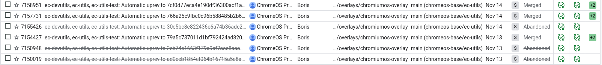
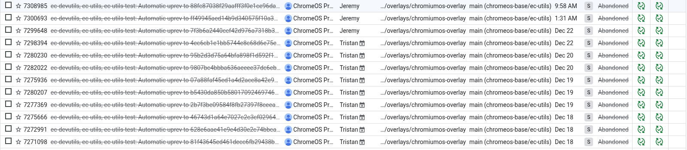

# Parallel Uprevs for platform/ec

## Overview

Since the platform/ec repo doesn't use the normal ebuild based CQ some of the
ebuild files don't use the normal automatic uprev. Instead the go/pupr tool
creates new CLs to uprev the chromeos-base/ec-utils and send them through the
slow CQ running all the ebuilds that depend on it.

## Reviewer responsibilities

For the most part you can ignore these CLs. However if you see an email like

> Abandoned
>
> This CL is abandoned by PUpr since it has failed CQ > 0 times.

then you have work to do.

1. Look at [recent commits](https://chromium-review.googlesource.com/q/topic:%22chromeos-base/ec-utils%22), have any merged since your failure? If so, this is fine. For example:

   GOOD: 

   BAD: 

2. Are the errors flakes? Pick the newest open commit, and vote CQ+2 on it to
   retry.
3. Look at the CQ failures to see what is failing. Can you fix it?
4. To make sure this doesn't happen again, find offending commit that broke. If
   you look at the first failing pupr change, the bad commit will be one of the
   hashes mentioned in the `Pupr-Upstream-Versions` in the commit message.
5. Add something to `zephyr/firmware_builder.py` to catch the failure. Or if a
   full cq run would have caught the problem, then edit
   `~/chromiumos/infra/config/build_targets.star` to cause a full run when that
   file is modified. See [cq-excludes](../util/cq-excludes/README.md) for help
   with editing the cq excludes patterns.

## Failure implications

If the CL fails to merge, then the ectool binary will not be built with the
latest code.
