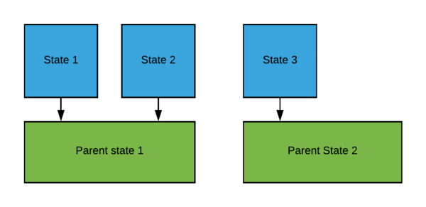
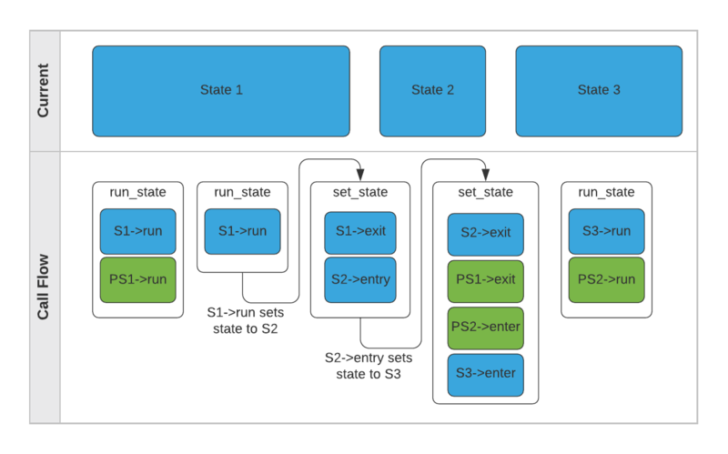
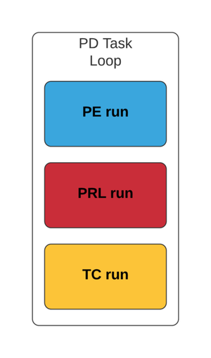
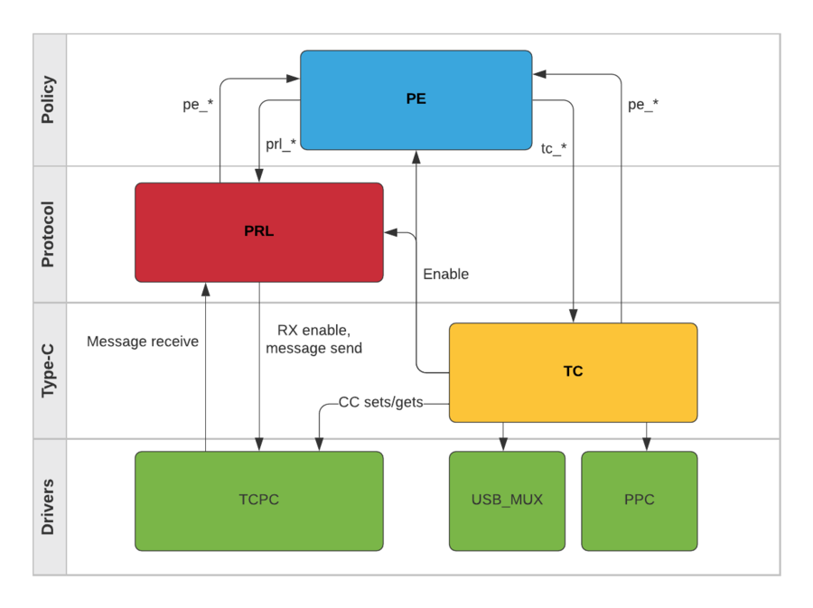

# EC USB-C Power Delivery TCPMv2 Overview

As the original USB-C Power Delivery (PD) solution for the ChromeOS Embedded Controller has aged, it has grown to the point where it is difficult to add new features and address bugs.  A new PD stack (generally referred to as TCPMv2) has been introduced to the codebase for use moving forward.  It implements a layered, state-based design which tracks more closely with the USB Type-C and USB PD specifications.

[TOC]

## Enabling TCPMv2

Boards may enable TCPMv2 by adding the following defines:


*   `CONFIG_USB_PD_TCPMV2`Configures the board to use the new stack.
*   `CONFIG_USB_DRP_ACC_TRYSRC`: Configures the type of state machine to run (in this case, a DRP which performs Try.SRC behavior).  Currently available are DRP and charge-through Vconn-powered device options
*   `CONFIG_USB_PD_DECODE_SOP`: Sets up messaging for SOP’ and SOP’’, which is strongly encouraged in the TCPMv2 code moving forward
*   `CONFIG_USB_PID 0x1234`: Sets the USB Product Identifier.  This will be shared for all boards within one reference design, and new PIDs may be requested by sending an email to the ChromeOS FW Team.
*   `CONFIG_USB_PD_REV30`: The TCPMv2 stack defaults to PD2.0 operation but defining this macro enables PD3.0 functionality.

Other configurations to specify behaviors within the task still apply (ex. `CONFIG_USB_PD_ALT_MODE_DFP` and `CONFIG_USB_PD_TCPC_LOW_POWER`).


## State Machine Framework

The basis of the TCPMv2 state machines is a generic state machine framework.  This framework can be found in common/usbc/usb\_sm.c.  For each state, there may be defined:


*   Entry: Called upon entering a state
*   Run: Called while steady in a state
*   Exit: Called upon leaving a state
*   Parent: Superstate.  Enters, exits, and runs alongside the child state.  Only enters and exits when transitioning between states which do not share the parent.

All fields are optional and may be set to NULL.  A new state is transitioned to with a call into set\_state(), which exits the old state and parents and enters the new parents and state.  States may be changed with set\_state() in any entry or run function, but any call from an exit function is ignored since exit is only called when a change is already in progress.  While in a state, run\_state() executes the run function for the current state and parents.  If set\_state() is called from either an entry function or a run function, the remaining run or entry functions are stopped.

Below is a graphical example of what some states may look like.  States 1 and 2 share Parent State 1, while State 3 has Parent State of 2.





Translated into code, this would be something like below (note it is not necessary that the states be a part of an array, but the TCPMv2 code generally organizes the states in this way):


```
static const struct usb_state test_states[] = {
        [PARENT_1] = {
                .entry = parent_1_entry,
                .run = parent_1_run,
                .exit = parent_1_exit,
        },
        [PARENT_2] = {
                .entry = parent_2_entry,
                .run = parent_2_run,
                .exit = parent_2_exit,
        },
        [STATE_1] = {
                .entry = state_1_entry,
                .run = state_1_run,
                .exit = state_1_exit,
                .parent = &test_states[PARENT_1],
        },
        [STATE_2] = {
                .entry = state_2_entry,
                .run = state_2_run,
                .exit = state_2_exit,
                .parent = &test_states[PARENT_1],
        },
        [STATE_3] = {
                .entry = state_3_entry,
                .run = state_3_run,
                .exit = state_3_exit,
                .parent = &test_states[PARENT_2],
        },
};
```


For this example, each test state is written simply to produce a print of its function name.  The two exceptions are:


*   parent\_1\_run() calls set\_state() into STATE\_2 when called a second time
*   state\_2\_entry() calls set\_state() into STATE\_3

Graphically, this is represented below:





And the following code output is produced:


```
Calling run_state()
state_1_run
parent_1_run

Calling run_state()
state_1_run
state_1_run calling set_state() to state 2
state_1_exit
state_2_entry
state_2_entry calling set_state() to state 3
state_2_exit
parent_1_exit
parent_2_entry
state_3_entry

Calling run_state()
state_3_run
parent_2_run
```


## TCPMv2 PD Task

The TCPMv2 PD task is built upon state machines using the above framework and is located in common/usbc/usbc\_task.c.  It is separated into three layers which track with the USB Type-C and USB PD specification states and run in a loop with 5 ms periods between executions.  A graphical representation of these layers is below.





The task is designed such that the Type-C (TC) layer could run independently for any application which doesn’t wish to enable PD messaging.  Boards define their appropriate Policy Engine (PE) and TC state machines through their selection of a CONFIG\_USB\_\* define, with current options supporting both Dual-Role Ports (DRPs) and Charge-Through Vconn-Powered Device (CTVPD).  All boards use the same Protocol Layer (PRL) code.


## TCPMv2 Layers


### Overview

The three state machines mentioned above interact with each other and the EC drivers in order to orchestrate all Type-C connection behavior.  Graphically, they are represented below.





Layers communicate with each other using atomic operations on flags and shared buffers.  Functions calling into each layer are clearly named to indicate the layer they are acting on, and anything calling into the PD task should be doing so through pd\_\* named functions.

Some specific examples of how this communication works between layers is below.  If a port partner sends in a Vconn\_swap request, then:


*   PRL will communicate that a message was received to the PE layer through pe\_message\_received(), which sets PE\_FLAGS\_MSG\_RECEIVED and indicates the receive buffer has a message
*   PE asks with the TC whether the board is sourcing Vconn with tc\_is\_vconn\_src() which checks TC\_FLAGS\_VCONN\_ON
*   PE tells the PRL to send an ACCEPT message to the port partner through prl\_send\_ctrl\_msg() which fills in shared message information and sets PRL\_FLAGS\_MSG\_XMIT
*   PRL lets the PE know that the message transmit was successful through pe\_message\_sent() which sets PE\_FLAGS\_TX\_COMPLETE
*   TC tells the PE layer that the Vconn swap completed with pe\_vconn\_swap\_complete() which sets PE\_FLAGS\_VCONN\_SWAP\_COMPLETE


### Type-C Layer

Defined in the USB Type-C specification, this layer is responsible for basic connection.  It takes care of setting the CC lines, detecting and debouncing the partner CC lines, and performs most of the interactions needed with the PPC and USB mux.  Once the TC layer has gotten the connection to the point of being Attached.SNK or Attached.SRC, it will enable the PRL and PE layers accordingly.


### Protocol Layer

A part of the USB PD specification, the protocol layer is responsible for the actual sending and receiving of PD messages with the TCPCs.  The layer is actually composed of 4 separate state machines running one after the other.  These state machines are:


*   Chunked receive (RCH):  passes messages up to the PE and requests chunks when chunking
*   Chunked transmit (TCH): receives messages from the PE and waits for chunk requests when chunking
*   Protocol transmit (PRL\_TX): passes messages to the TCPCs and handles PD 3.0 collision avoidance
*   Protocol hard reset (PRL\_HR): responds to or transmits hard resets, resets PRL layer variables, notifies PE of hard reset receipt or sent


### Policy Engine Layer

The PE layer states are defined as a part of the USB PD specification.  State names are meant to track very closely with the specification so they can be easily searchable and understood.  The PE’s primary responsibility is to send and process PD messages in order to implement the port’s policy.


## Best Practices


*   Always call return after set\_state().  Once the state has been changed, nothing further should be done in the current state.
*   Never call set\_state() from an exit function.  The call will be ignored as there is already a state transition taking place.
*   Never call set\_state() from outside the PD task.  The task may be waiting in any number of locations and the context should not change around it while it does so.
*   Always use flags to communicate between layers, and to communicate with the PD task from other tasks.  Flags should be accessed through atomic operations.
*   Always use pd\_\* functions to access the PD task from other tasks.
*   Always write unit tests as code is added, to verify new code works and protect against regressions as development continues.
