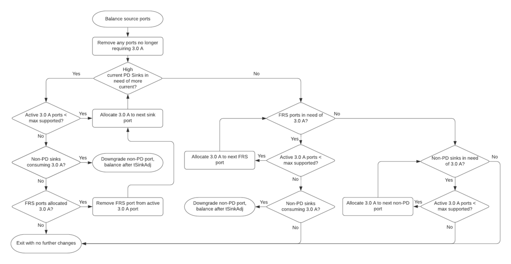

# USB Power Considerations

Users want to be able to charge external devices using their Chromebook USB
ports, e.g. charge a phone from their Chromebook. We want to provide a fast
charging experience to end-users, so we prefer to offer high power charging when
possible.

[TOC]

## Summary of Design Requirements

For explanations of calculations see rest of doc.

### Total System Power

Total current needed for external USB devices at 5V:

```
((Number of Type-C Ports) * (1800mA)) + 1500mA +
((Number of Type-A Ports) * (900mA)) + 600mA§
```

§ The additional 600mA can be omitted if BC1.2 is not supported for Type-A

### Daughter Board Considerations

If a daughter board has 1 Type-A (supporting BC 1.2) and 1 Type-C, the max
potential current load at 5V is `Type-A Vbus (1500mA) + Type-C Vbus (3000mA) +
Type-C Vconn (300mA) = 4800mA`

*   The DB ribbon cables need to be able to carry enough current to supply 24W
    (4.8A * 5V) of power to the DB.
    *   This may be on a single or multiple power rails depending on hardware
        design.
*   The ground path on the ribbon cable from the DB also needs to be able to
    carry enough current to match the power rails.

## USB Type-A Ports

For Type-A ports, the [BC 1.2 Specification] adds higher power modes on top of
the [USB 3.2 Specification]. While BC 1.2 support isn't required, it is
preferred, as it allows end-users to charge their devices more quickly.

[BC 1.2 Specification] defines multiple modes of operation including, but not
limited to:

*   CDP - Charging Downstream Port
    *   Allows USB Data. Provides guaranteed 1.5A @ 5V power.
    *   ChromeOS device can act as a CDP.
*   SDP - Standard Downstream Port
    *   Allows USB Data. Provides guaranteed current defined by USB
        Specifications
        *   For USB3, provides guaranteed current of 0.9A @ 5V.
        *   For USB2, provides guaranteed current of 0.5A @ 5V.
    *   ChromeOS device can act as a SDP.
*   DCP - Dedicated Charging Port
    *   No USB Data. Provides max of 1.5A @ 5V power.
    *   ChromeOS device **will not** act as a DCP.

For detection logic of each mode (e.g. on the D+ and D- pins) and nuance of
power/current power requirements, see full [BC 1.2 Specification].

Without BC 1.2 support, the max power requirements match that of a Standard
Downstream Port (SDP) as defined by various specification (e.g.
[USB 3.2 Specification]).

### ChromeOS as Source - Policy for Type-A

If BC 1.2 is supported on a ChromeOS device, then the first Type-A port in use
will act as a CDP, providing a maximum current of 1.5A while also enabling USB
data. All other Type-A ports will only be SDP, providing a maximum current of
900mA.

Note that the CDP Type-A port allocation is dynamic; the first Type-A port to
draw more than 900mA gets to be the CDP, with a maximum current of 1.5A. Then
all other Type-A ports get downgraded to the lower, 900mA current limit (i.e.
SDP) while the first Type-A port maintains a current draw of more than 900mA. In
practice, this means that the first Type-A device plugged in gets to consume
1.5A and any Type-A device inserted after that will only get 900mA.

Once the Type-A device drawing 1.5A stops pulling more than 900mA or is
physically removed, then the extra 600mA (as well as CDP advertisement) becomes
available to any Type-A port. In practice, Type-A devices only determine current
limits when they are first inserted, so any Type-A device that is still plugged
in when the 1.5A device is removed will not notice that it can pull more
current. This means that the first Type-A device **inserted** after removing the
original 1.5A device gets access to 1.5A.

The allocation of the one CDP Type-A port is unaffected by user interaction with
Type-C ports. Once a Type-A port has been claimed as CDP, inserting a Type-C
device will not revoke the CDP status of the Type-A port.

For example, the below sequence of events illustrates the above Type-A policy if
BC 1.2 is supported:

1.  Insert Type-A phone first
    *   Since no other Type-A port is currently supplying more than 900mA, this
        port can supply 1.5A as the CDP.
    *   Phone pulls 1.5A; other Type-A ports are now marked as SDPs limiting
        current to 900mA, each.
    *   Current state: `phone @ 1.5A`.
2.  Insert Type-A mouse second
    *   Mouse is only allowed 900mA since port is SDP.
    *   Current state: `phone @ 1.5A` and `mouse @ 900mA`.
3.  Remove phone
    *   High-current port status is relinquished. Now first Type-A port to draw
        more than 900mA will claim the one high-current port status (as the
        CDP).
    *   Mouse does not realize that more power is available since most Type-A
        devices only determine their current limits upon connection.
    *   Current state: `mouse @ 900ma`.
4.  Insert Type-A battery pack
    *   Since no other Type-A port is currently supplying more than 900mA, this
        port can supply 1.5A as the CDP.
    *   Battery pack pulls 1.5A; other Type-A ports are now marked as SDPs
        limiting current to 900mA, each.
    *   Current state: `mouse @ 900ma` and `battery pack @ 1.5A`.

The total current needed for all Type-A ports at 5V is:

```
if (BC1.2_Supported)
    (# Type-A Ports)*(900mA) + 600mA
else
    (# Type-A Ports)*(900mA)
```

## USB Type-C Ports

USB Type-C allows for dynamic negotiation of high power contracts; this is
accomplished through varying CC resistors and/or USB-C Power Delivery (PD). More
in-depth information can be found in the [USB Type-C Specification] \(section
4.5.2.3) and the [USB PD Specification]. CC resistor contracts can range from
500mA/5V to 3A/5V, while PD contracts can range from 0mA/3.3V to 5A/20V.

### ChromeOS as Source - Policy for Type-C

**Note:** Behavior outlined here is only implemented in the TCPMv2 Device
Policy Manager (DPM) when a board defines a non-zero maximum number of 3A
ports supported through `CONFIG_USB_PD_3A_PORTS`.

ChromeOS devices currently source power to external USB devices at 5V with a
typical current of 1.5A for each Type-C port. In certain scenarios, a Type-C
port can source up to 3A @ 5V.

ChromeOS prefers that the first PD-capable Type-C device **that requires 3A**
should get 3A guaranteed at 5V. Once the maximum supported number of PD-capable
Type-C device has claimed 3A, then other PD-capable Type-C devices will only be
offered a maximum of 1.5A.

If Fast Role Swap (FRS) is supported and a sourcing port partner reports
requiring 3A after a fast role swap, then this port should be allocated 3A if
no more PD-capable sinks require 3A, and FRS detection may be enabled.  Once a
PD-capable device **that requires 3A** is inserted, the FRS port may have FRS
detection disabled if the maximum number of 3A ports has been reached.

If there are no PD-capable Type-C devices requiring 3A and no FRS ports
requiring 3A, then the first non-PD device will be given 3A until a PD-capable
device **that requires 3A** is inserted, or until an FRS source that requires
3A is inserted.

Devices will indicate they require 3A operating current in their sink
capabilities, and this will be used as the trigger to let the EC know to
offer that port a 3A source contract.  FRS source partners will also
indicate the need for 3A in their sink capabilities, under their Fast Role
Swap required current.

This policy is laid out in the following flow chart.  Current policy for the
"next" port allocation is to select the lowest port number any time more than
one port meets criteria to receive 3A.

Port balancing will occur when:
* Sink Capabilities are received for a device
* Source capabilities are not replied to after nCapsCount, indicating a non-PD
  sink
* Power roles are swapped
* Detach occurs



Inserting a Type-A device does not affect the power assignment for Type-C ports;
only Type-C devices affect the power of Type-C ports.

For example, the below sequence of events illustrates the above Type-C policy
with a board with a maximum number of 1 3A-ports supported:

1.  A non-PD capable Type-C keyboard is inserted first
    *   Keyboard will be offered 1.5A initially
    *   Current state: `keyboard @ 1.5A`.
2.  Partner is established to be non-PD through reaching PE\_SRC\_Disabled.
    *   Since there are no other PD-capable devices and this is the first
        device, offer this device 3A via CC resistor change.
    *   Current state: `keyboard @ 3A`.
3.  A non-PD capable Type-C mouse is inserted second
    *   It will be offered 1.5A since there is already another non-PD device
        claiming 3A.
    *   Current state: `keyboard @ 3A` and `mouse @ 1.5A`.
4.  A PD-capable Type-C hub is inserted third
    *   Initially negotiate for 1.5A.
    *   Since this is a PD device, query its operational current through
        requesting Sink Capabilities.
    *   Hub does not want high power from Chromebook; hub continues to receive
        1.5A.
    *   Keyboard gets to maintain higher 3A current supply.
    *   Current state: `keyboard @ 3A` and `mouse @ 1.5A` and `hub @ 1.5A`.
5.  A PD-capable Type-C phone is inserted fourth
    *   Phone is initially offered 1.5A.
    *   Since this is a PD device, query its operational current through
        requesting Sink Capabilities.
    *   The phone reports it wants 3A.
    *   Since PD devices are preferred for 3A, the non-PD keyboard will be
        downgraded from 3A to 1.5A via a CC resistor change.
    *   After tSinkAdj (60 ms), phone is offered 3A through new Source
        Capabilities.
    *   Current state: `keyboard @ 1.5A` and `mouse @ 1.5A` and `hub @ 1.5A`
        and `phone @ 3A`.
6.  A PD-capable Type-C tablet is inserted fifth
    *   Tablet is initially offered 1.5A.
    *   Since this is a PD device, query its operational current through
        requesting Sink Capabilities.
    *   Tablet would like 3A, but the board has reached its maximum number of
        supported 3A ports.  Note this port's desired current for later.
    *   Current state: `keyboard @ 1.5A` and `mouse @ 1.5A` and `hub @ 1.5A`
        and `phone @ 3A` and `tablet @ 1.5A`.
7.  The PD-capable phone is removed
    *   The next PD-capable sink device is offered 3A: the tablet
    *   Current state: `keyboard @ 1.5A` and `mouse @ 1.5A` and `hub @ 1.5A`
        and `tablet @ 3A`.
8.  A FRS-capable dock is inserted
    *   The dock is sourcing us
    *   Since this is a PD capable device, query its FRS current through
        requesting Sink Capabilities.
    *   Dock reports requiring 3A current after FRS.
    *   Tablet is currently occupying the 3A port, so note this port's desired
        FRS current for later.
    *   Current state: `keyboard @ 1.5A` and `mouse @ 1.5A` and `hub @ 1.5A`
        and `tablet @ 3A`; dock `FRS detection disabled`
9.  The PD-capable tablet is removed
    *   The next PD-capable device requiring 3A is offered 3A. If there are
        no PD-capable devices requiring 3A, then the next FRS device is
        allocated 3A.
    *   The hub only requires 1.5A, so FRS is enabled for the dock.
    *   Current state: `keyboard @ 1.5A` and `mouse @ 1.5A` and `hub @ 1.5A`;
        dock `FRS detection enabled`
10.  The FRS dock is removed
    *   The next PD-capable  device requiring 3A is offered 3A. If there are
        no PD-capable devices requiring 3A, then the next FRS device is
        allocated 3A.  If there are no FRS devices, then the next non-PD
        capable device is given 3A.
    *   The hub only requires 1.5A, so mouse is given 3A via CC
        resistor change.
    *   Current state: `keyboard @ 1.5A` and `mouse @ 3A` and `hub @ 1.5A`.
11. The non-PD capable mouse is removed
    *   The hub does not require 3A.
    *   Current state: `keyboard @ 3A` and `hub @ 1.5A`.

Note: Not all released Chromebooks implement the above policy due to
pre-existing hardware design constraints.

Type-C ports also need to provide an additional 300mA @ 5V (1.5W) for Vconn on
every port. Note: the 1.5W for Vconn may also be supplied at other voltages,
such as 455mA @ 3.3V instead.

The total current needed for all Type-C ports at 5V is:

```
((Number of Type-C Ports) * (1500mA + 300mA)) + 1500mA
```

The total maximum current needed for a single Type-C port at 5V is `(3000mA +
300mA) = 3.3A`. This max current for a single port is especially relevant for
sizing the daughter board ribbon cable appropriately.

[BC 1.2 Specification]: <https://www.usb.org/document-library/battery-charging-v12-spec-and-adopters-agreement>
[USB 3.2 Specification]: <https://www.usb.org/document-library/usb-32-specification-released-september-22-2017-and-ecns>
[USB PD Specification]: https://www.usb.org/document-library/usb-power-delivery
[USB Type-C Specification]: https://www.usb.org/document-library/usb-type-cr-cable-and-connector-specification-revision-14-march-29-2019
