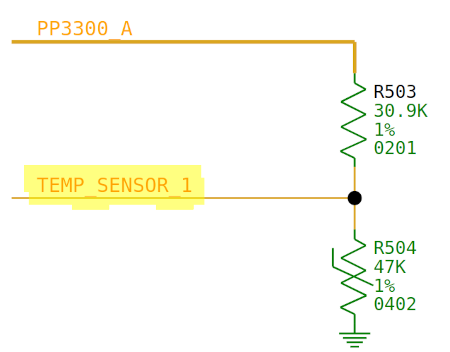

# Zephyr EC Temperature Sensors

- [Zephyr EC Temperature Sensors](#zephyr-ec-temperature-sensors)
	- [Overview](#overview)
		- [Zephyr-supported Temperature Sensors](#zephyr-supported-temperature-sensors)
			- [Supported Thermistor Configurations](#supported-thermistor-configurations)
		- [Legacy EC Temperature Sensors](#legacy-ec-temperature-sensors)
	- [Kconfig Options](#kconfig-options)
	- [Device Tree Nodes](#device-tree-nodes)
		- [Thermistors](#thermistors)
			- [Thermistor Circuit](#thermistor-circuit)
	- [Board-specific code](#board-specific-code)
	- [Threads](#threads)
		- [Thermistors](#thermistors-1)
		- [I2C-based Sensors](#i2c-based-sensors)
- [Testing and Debugging](#testing-and-debugging)

## Overview
Temperature sensors are critical for monitoring the operating temperature of
the device and taking action if temperatures rise beyond safe levels by
throttling or shutting down the AP.

### Zephyr-supported Temperature Sensors

| Part | File | Description |
|---|---|---|
| TMP112 | [driver/temp_sensor/tmp112.h](../../driver/temp_sensor/tmp112.h) | SMBus / I2C temperature sensor |
| Thermistors | [driver/temp_sensor/thermistor.c](../../driver/temp_sensor/thermistor.c) | Various analog thermistor configurations |

#### Supported Thermistor Configurations

   * `thermistor_3V3_30K9_47K_4050B`
   * `thermistor_3V0_22K6_47K_4050B`
   * `thermistor_3V3_13K7_47K_4050B`
   * `thermistor_3V3_51K1_47K_4050B`

See [zephyr/include/cros/thermistor/thermistor.dtsi](../../zephyr/include/cros/thermistor/thermistor.dtsi)
and [zephyr/test/drivers/overlay.dts](../../zephyr/test/drivers/overlay.dts)
to see where these are defined.

### Legacy EC Temperature Sensors
These models have drivers written for the legacy EC code, but would need
further work to adapt to Zephyr.

| Part # | File | Description |
|---|---|---|
| ADT7481 | [driver/temp_sensor/adt7481.h](../../driver/temp_sensor/adt7481.h) | SMBus / I2C 3-channel temperature sensor (local + 2x remote) |
| R19ME4070 | [driver/temp_sensor/amd_r19me4070.h](../../driver/temp_sensor/amd_r19me4070.h) | AMD GPU, but has an onboard temperature sensor. |
| BD99992GW | [driver/temp_sensor/bd99992gw.h](../../driver/temp_sensor/bd99992gw.h) | This is a PMIC, but has an onboard temp sensor. |
| F75303 | [driver/temp_sensor/f75303.h](../../driver/temp_sensor/f75303.h) | SMBus / I2C 3-channel temperature sensor (local + 2x remote) |
| G781/G782 | [driver/temp_sensor/g78x.h](../../driver/temp_sensor/g78x.h) | SMBus / I2C 2-channel temperature sensor (local + remote) |
| G753 | [driver/temp_sensor/g753.h](../../driver/temp_sensor/g753.h) | SMBus / I2C single-channel temperature sensor |
| OTI502 | [driver/temp_sensor/oti502.h](../../driver/temp_sensor/oti502.h) | I2C ambient plus infrared temperature sensor |
| PCT2075 | [driver/temp_sensor/pct2075.h](../../driver/temp_sensor/pct2075.h) | I2C temperature sensor |
| SB-TSI | [driver/temp_sensor/sb_tsi.h](../../driver/temp_sensor/sb_tsi.h) | I2C temp sensor on the AMD Stony Ridge FT4 SOC |
| NCP15WB | [driver/temp_sensor/thermistor_ncp15wb.c](../../driver/temp_sensor/thermistor_ncp15wb.c) | NTC thermistor (used with ADC) |
| TMP006 | [driver/temp_sensor/tmp006.h](../../driver/temp_sensor/tmp006.h) | SMBus / I2C infrared temperature sensor |
| TMP112 | [driver/temp_sensor/tmp112.h](../../driver/temp_sensor/tmp112.h) | SMBus / I2C temperature sensor |
| TMP411 | [driver/temp_sensor/tmp411.h](../../driver/temp_sensor/tmp411.h) | SMBus / I2C 2-channel temperature sensor (local + remote) |
| TMP432 | [driver/temp_sensor/tmp432.h](../../driver/temp_sensor/tmp432.h) | SMBus / I2C 2-channel temperature sensor (local + remote) |
| TMP468 | [driver/temp_sensor/tmp468.h](../../driver/temp_sensor/tmp468.h) | SMBus / I2C 9-channel temperature sensor (local + 8x remote) |

## Kconfig Options

Overall support for temperature sensors is enabled using the config flag
`PLATFORM_EC_TEMP_SENSOR`. See [zephyr/Kconfig.temperature](../../zephyr/Kconfig.temperature)
for more information. A separate config flag, `PLATFORM_EC_THERMISTOR`, is needed
if analog thermistor sensors are being used. This option is dependent on ADCs
being supported. These flags are configured in each board’s `prj.conf` file.

There are no sensor-specific Kconfig options for specifying sensor types,
drivers, or configuration. This is handled by the device tree (see below)
on Zephyr-based boards.

## Device Tree Nodes

Temperature sensors are declared in a `named-temp-sensors section` in the device
tree. This example is from [zephyr/boards/arm/brya/brya.dts](../../zephyr/boards/arm/brya/brya.dts):

```
	named-temp-sensors {
		ddr_soc {
			compatible = "cros-ec,temp-sensor";
			thermistor = <&thermistor_3V3_30K9_47K_4050B>;
			label = "DDR and SOC";
			enum-name = "TEMP_SENSOR_1_DDR_SOC";
			temp_fan_off = <35>;
			temp_fan_max = <60>;
			temp_host_high = <85>;
			temp_host_halt = <90>;
			temp_host_release_high = <80>;
			adc = <&adc_ddr_soc>;
		};
```

More information about temperature sensor device tree settings can be found in the
following locations:

 * [cros_ec_temp_sensor.yaml](../../zephyr/dts/bindings/temp/cros_ec_temp_sensor.yaml) - Common properties
 * [cors_ec_temp_sensor_thermistor.yaml](../../zephyr/dts/bindings/temp/cors_ec_temp_sensor_thermistor.yaml) - Special properties for analog thermistors
 * [cros_ec_temp_sensor_tmp112.yaml](../../zephyr/dts/bindings/temp/cros_ec_temp_sensor_tmp112.yaml) - Properties for the TMP112 I2C-based sensor

### Thermistors

In addition to setting up the sensors, each type of supported thermistor needs to
have calibration data saved in the device tree that is used to compute temperature
values from the ADC counts / measured voltages. Example from
[zephyr/include/cros/thermistor/thermistor.dtsi](../../zephyr/include/cros/thermistor/thermistor.dtsi).

This must only be done once for each type of thermistor. Most boards should be
covered by one of the existing types and can simply reference them in the device
tree named-temp-sensors nodes.

```
	thermistor_3V3_30K9_47K_4050B: thermistor-3V3-30K9-47K-4050B {
		status = "disabled";
		compatible = "cros-ec,thermistor";
		scaling-factor = <11>;
		num-pairs = <10>;
		steinhart-reference-mv = <3300>;
		steinhart-reference-res = <30900>;
		/*
		 * Data derived from Steinhart-Hart equation in a resistor
		 * divider circuit with Vdd=3300mV, R = 30.9Kohm, and thermistor
		 * (B = 4050, T0 = 298.15 K, nominal resistance (R0) = 47Kohm).
		 */
		sample-datum-0 {
			milivolt = <(2753 / 11)>;
			temp = <0>;
			sample-index = <0>;
		};
		sample-datum-1 {
			milivolt = <(2487 / 11)>;
			temp = <10>;
			sample-index = <1>;
		};
		/* . . . */
```

#### Thermistor Circuit

Type `thermistor_3V3_30K9_47K_4050B` corresponds to this circuit:



The thermistor naming scheme is as follows:
 * `3V3` - The voltage divider is supplied from a 3.3V rail.
 * `30K9` - The high side of the voltage divider is a 30.9K ohm resistor.
 * `47K` - The nominal thermistor resistance (R_0) is 47K ohm.
 * `4050B` - Coefficient B in the Steinhart–Hart thermistor equation is 4050.

## Board-specific code

No board-specific code is required. Temperature sensors are automatically configured
based on information in the device tree.

## Threads

There is no dedicated thread for monitoring temperature sensors. The sensor data is
ultimately consumed by the thermal engine’s `thermal_control()` function in
[common/thermal.c](../../common/thermal.c), which runs every second in the TICK
thread by registering it as a callback with the Hook API.

The mechanism for pulling in temperature data depends on the type of sensor:

### Thermistors

Thermistor-based temperature sensor readings are measured and processed on-the-fly
whenever requested, so the TICK thread reads from the ADC directly during the
`thermal_control()` routine.

### I2C-based Sensors

Most I2C-based sensors involve an extra step. Their drivers separately set up an
internal function to run on a one second interval (also on the TICK task using the
Hook API). For example, the TMP006 does this in [tmp006.c](../../driver/temp_sensor/tmp006.c):

```c
static void tmp006_poll(void)
{
	int i;

	for (i = 0; i < TMP006_COUNT; ++i)
		tmp006_poll_sensor(i);
}
DECLARE_HOOK(HOOK_SECOND, tmp006_poll, HOOK_PRIO_TEMP_SENSOR);
```

The poll function only updates an internal struct within the driver with the latest
reading(s). These values then get read by the thermal engine through the same,
standard API as the thermistors. This spares the thermal routine from having to
wait on I2C accesses.

However, not all temperature sensor drivers follow this approach. For instance,
the [SB-TSI driver](../../driver/temp_sensor/sb_tsi.c) simply performs the I2C
transaction to read the temperature directly in the public `sb_tsi_get_val()`
function.

# Testing and Debugging

Temperature sensors can be queried with the `temps` console command:

```
> temps
  Charger             : 303 K = 30 C
  SOC                 : 303 K = 30 C
  CPU                 : 301 K = 28 C
```
